# 类图和包图详细设计

## 1. 完整类图（Mermaid）

### 1.1 整体类图

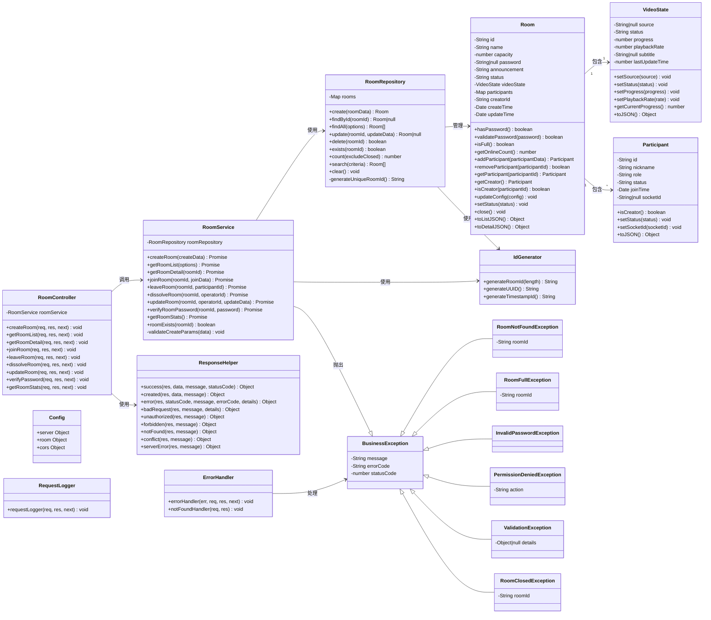

### 1.2 实体类详细图

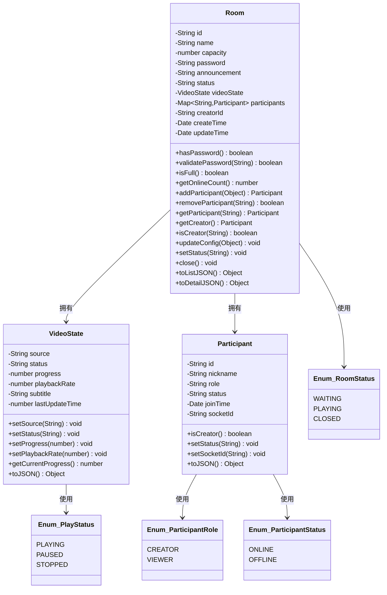

### 1.3 业务逻辑层类图

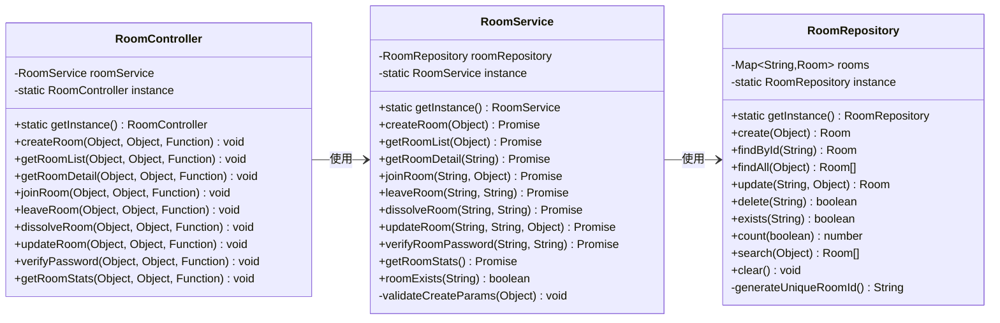

### 1.4 异常体系类图

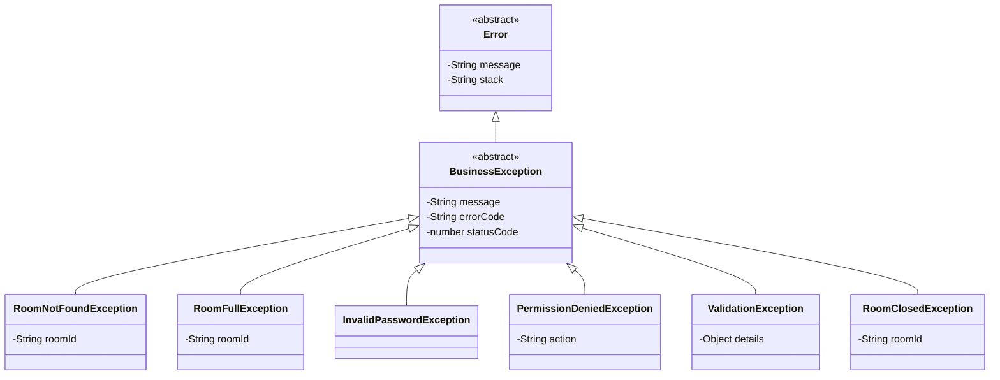

---

## 2. 包图（Mermaid）

### 2.1 完整包结构图

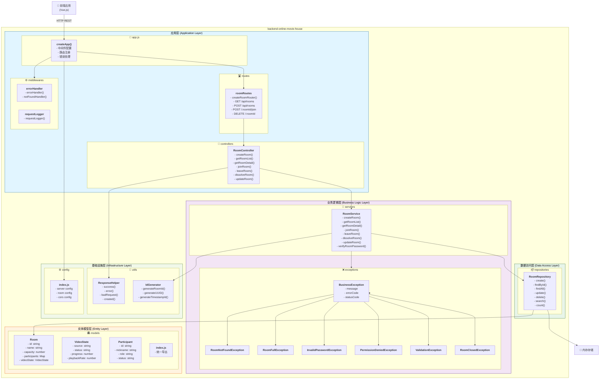

### 2.2 应用层包图

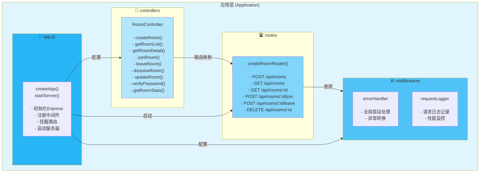

### 2.3 业务逻辑层包图

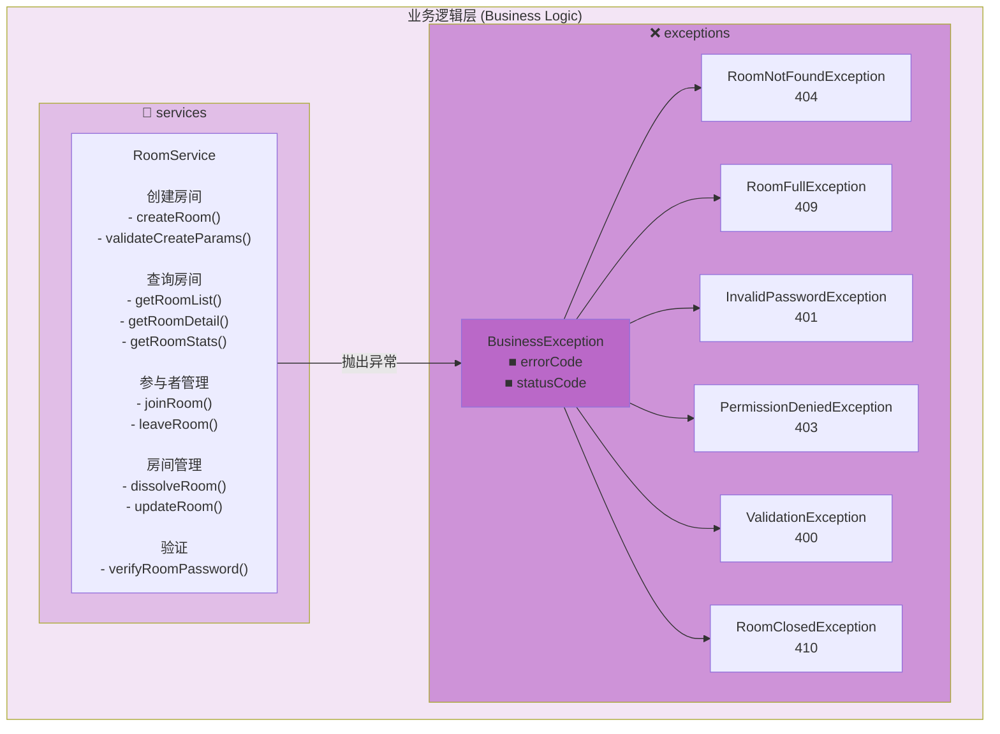

### 2.4 数据访问层和模型层包图

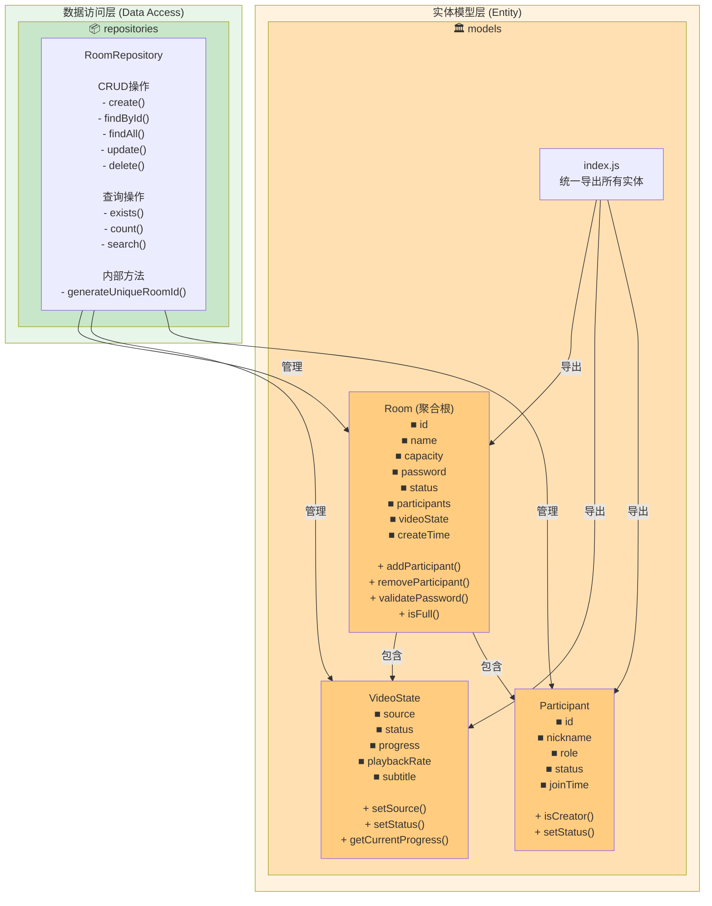

### 2.5 基础设施层包图

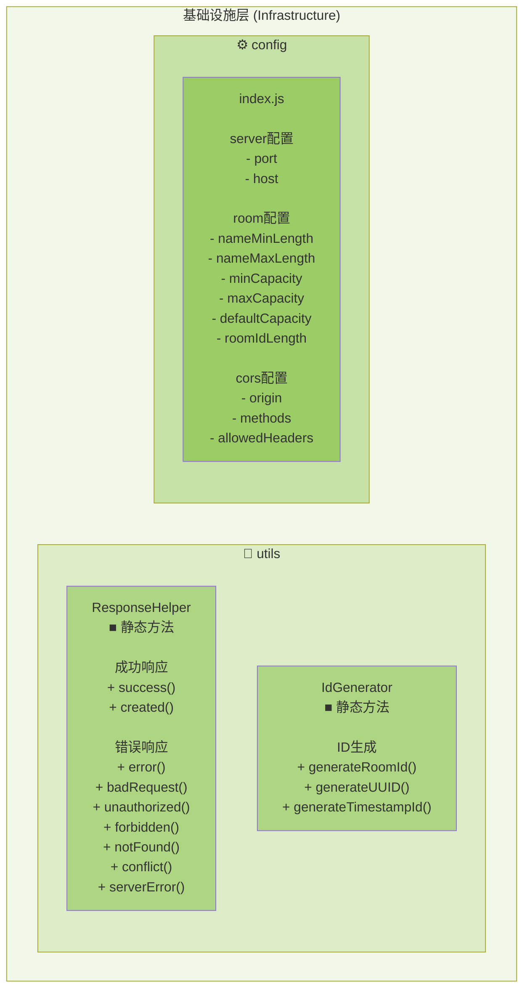

---

## 3. 层间接口定义

### 3.1 应用层 ↔ 业务逻辑层接口

```javascript
/**
 * RoomService 接口定义
 */
interface IRoomService {
  // 房间创建
  createRoom(data: {
    name: string;
    capacity?: number;
    password?: string;
    announcement?: string;
    creatorNickname: string;
  }): Promise<{
    room: RoomDetail;
    creator: { id: string; nickname: string; role: string };
  }>;

  // 房间查询
  getRoomList(options: {
    keyword?: string;
    status?: string;
    page?: number;
    pageSize?: number;
  }): Promise<{
    list: RoomSummary[];
    pagination: { page: number; pageSize: number; total: number; totalPages: number };
  }>;

  getRoomDetail(roomId: string): Promise<RoomDetail>;

  // 参与者管理
  joinRoom(roomId: string, data: {
    nickname: string;
    password?: string;
  }): Promise<{
    room: RoomDetail;
    participant: ParticipantInfo;
  }>;

  leaveRoom(roomId: string, participantId: string): Promise<boolean>;

  // 房间管理
  dissolveRoom(roomId: string, operatorId: string): Promise<boolean>;

  updateRoom(roomId: string, operatorId: string, data: {
    name?: string;
    capacity?: number;
    password?: string;
    announcement?: string;
  }): Promise<RoomDetail>;

  // 验证
  verifyRoomPassword(roomId: string, password: string): Promise<boolean>;

  // 统计
  getRoomStats(): Promise<{
    totalRooms: number;
    totalParticipants: number;
    waitingRooms: number;
    playingRooms: number;
  }>;
}
```

### 3.2 业务逻辑层 ↔ 数据访问层接口

```javascript
/**
 * RoomRepository 接口定义
 */
interface IRoomRepository {
  // 创建
  create(data: {
    name: string;
    capacity: number;
    password?: string;
    announcement: string;
    creatorId: string;
    creatorNickname: string;
  }): Room;

  // 查询
  findById(roomId: string): Room | null;

  findAll(options?: {
    excludeClosed?: boolean;
  }): Room[];

  // 更新
  update(roomId: string, data: any): Room | null;

  // 删除
  delete(roomId: string): boolean;

  // 检查
  exists(roomId: string): boolean;

  // 统计
  count(excludeClosed?: boolean): number;

  // 搜索
  search(criteria: {
    keyword?: string;
    status?: string;
    hasPassword?: boolean;
  }): Room[];
}
```

### 3.3 数据访问层 ↔ 实体模型层接口

```javascript
/**
 * Entity 基础接口
 */
interface IEntity {
  id: string;
  toJSON(): Object;
}

/**
 * Room 聚合根接口
 */
interface IRoom extends IEntity {
  // 属性
  id: string;
  name: string;
  capacity: number;
  status: string;
  participants: Map<string, Participant>;
  videoState: VideoState;
  creatorId: string;

  // 业务方法
  addParticipant(data: any): Participant | null;
  removeParticipant(participantId: string): boolean;
  getParticipant(participantId: string): Participant | undefined;
  isFull(): boolean;
  isCreator(participantId: string): boolean;
  validatePassword(password: string): boolean;
  updateConfig(config: any): void;
  close(): void;
}
```

---

## 4. 总体包依赖关系

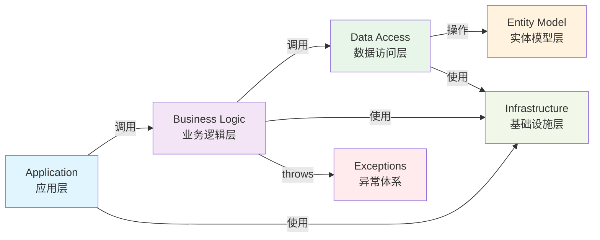

---

## 5. 数据流向图

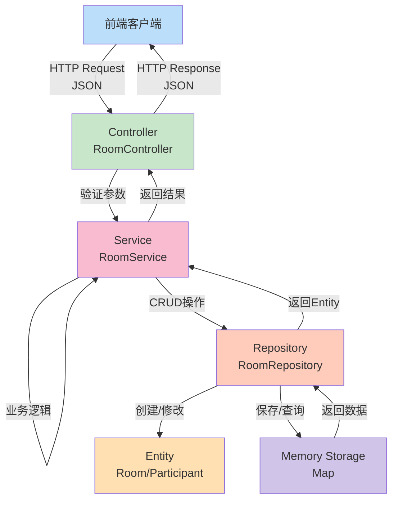

---

## 6. 模块化模式说明

### 单例模式实现

```javascript
// RoomService 的单例实现
class RoomService {
  static instance = null;
  
  static getInstance() {
    if (!RoomService.instance) {
      RoomService.instance = new RoomService();
    }
    return RoomService.instance;
  }
  
  constructor() {
    this.roomRepository = RoomRepository.getInstance();
  }
}

// 使用方式
const roomService = RoomService.getInstance();
```

### 工厂模式实现

```javascript
// 路由创建工厂
const createRoomRouter = () => {
  const router = express.Router();
  const roomController = RoomController.getInstance();
  
  router.get('/', roomController.getRoomList);
  router.post('/', roomController.createRoom);
  // ... 其他路由
  
  return router;
};

// 应用中使用
app.use('/api/rooms', createRoomRouter());
```

### 聚合根模式实现

```javascript
// Room 作为聚合根，管理 VideoState 和 Participant
class Room {
  constructor(options) {
    this.videoState = new VideoState();
    this.participants = new Map();
  }
  
  addParticipant(participantData) {
    const participant = new Participant(participantData);
    this.participants.set(participant.id, participant);
    return participant;
  }
  
  // Room 负责管理其所有子实体的业务规则
}
```
