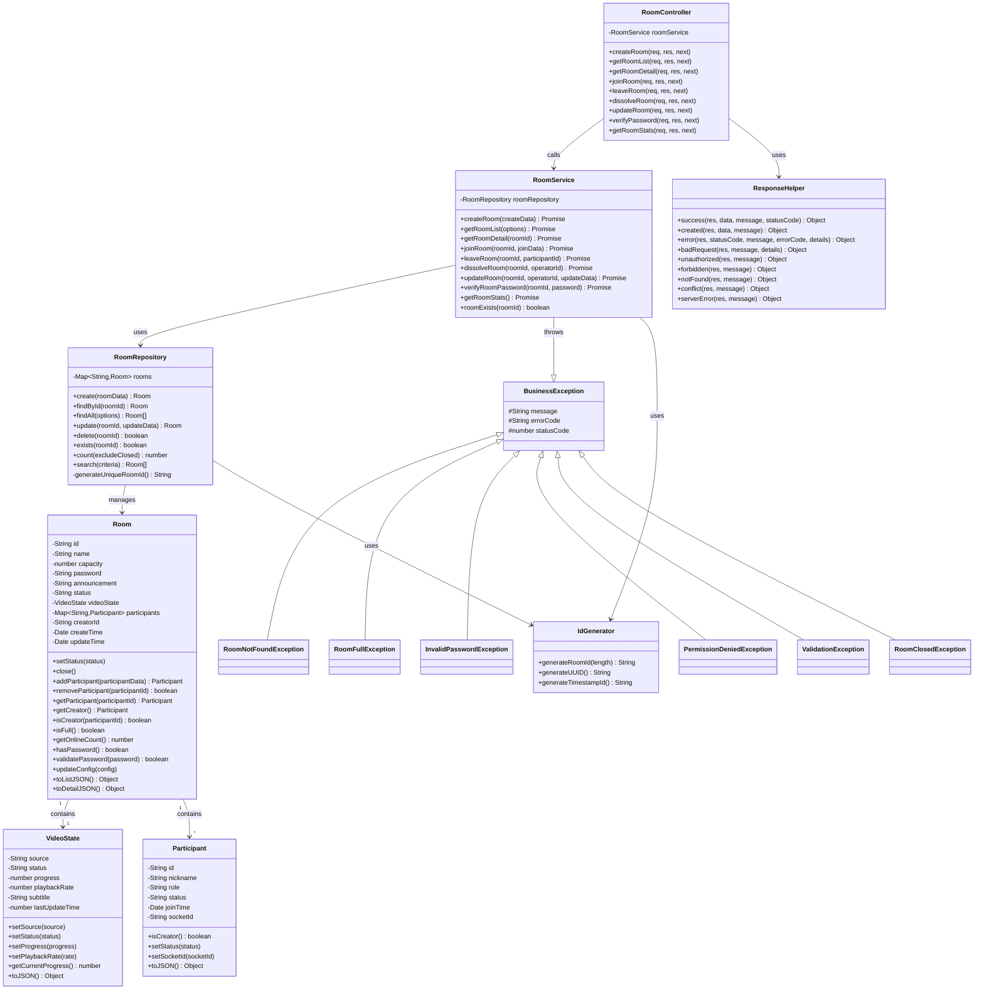
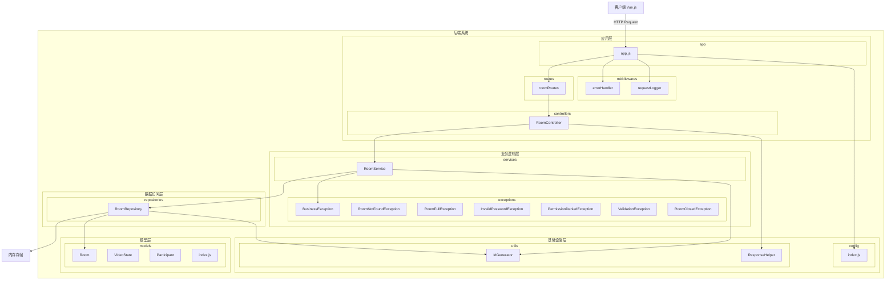
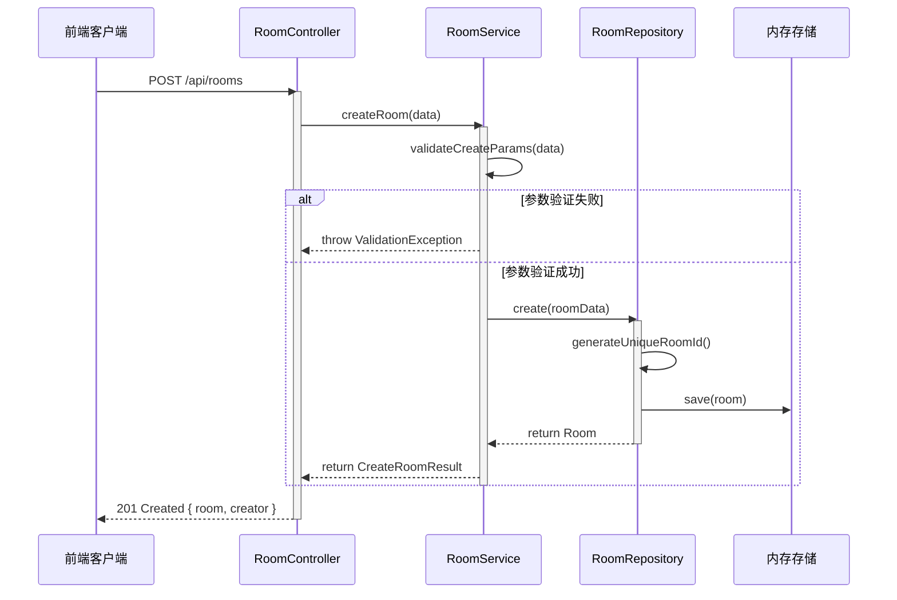
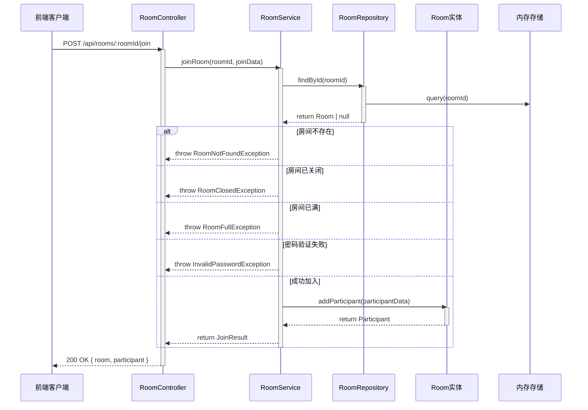
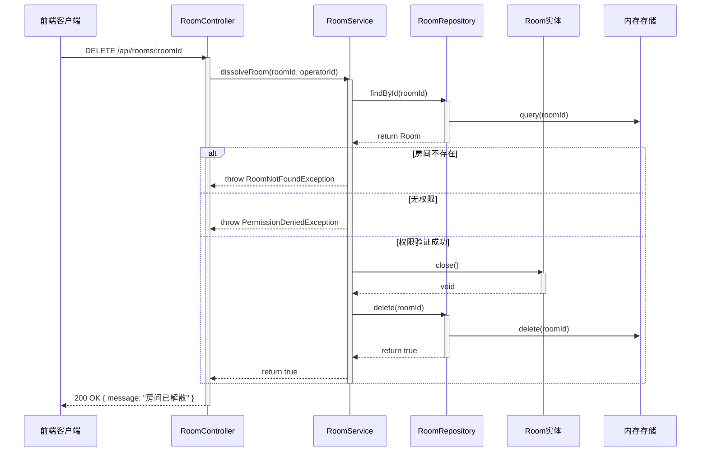

# 在线观影室后端 - 房间管理模块设计文档

## 目录

1. [架构设计](#架构设计)
2. [分层设计](#分层设计)
3. [类设计](#类设计)
4. [包结构与接口](#包结构与接口)
5. [数据模型](#数据模型)
6. [流程设计](#流程设计)

---

## 架构设计

### 1. 总体架构

房间管理模块采用分层架构设计，遵循MVC模式和Repository模式，确保代码的可维护性、可测试性和可扩展性。

```
┌─────────────────────────────────────────────────────────────┐
│                      前端应用 (Vue.js)                      │
└────────────────────┬────────────────────────────────────────┘
                     │ HTTP/REST
┌────────────────────▼────────────────────────────────────────┐
│                   Express.js 应用层                         │
├─────────────────────────────────────────────────────────────┤
│  Controllers (HTTP请求处理)                                │
│  Middlewares (中间件)                                       │
│  Routes (路由定义)                                          │
├─────────────────────────────────────────────────────────────┤
│  Services (业务逻辑层)                                      │
│  Exceptions (异常处理)                                      │
├─────────────────────────────────────────────────────────────┤
│  Repositories (数据访问层)                                  │
│  Models (数据模型)                                          │
├─────────────────────────────────────────────────────────────┤
│  Utils (工具类)                                             │
│  Config (配置)                                              │
├─────────────────────────────────────────────────────────────┤
│                   内存存储 (第一迭代)                        │
└─────────────────────────────────────────────────────────────┘
```

### 2. 架构设计原则

#### 2.1 分层设计
- **表现层** - 处理HTTP请求/响应，参数验证
- **业务逻辑层** - 实现核心业务规则，事务管理
- **数据访问层** - 屏蔽数据存储细节
- **领域模型层** - 定义核心业务实体
- **基础设施层** - 工具类、配置等

#### 2.2 设计模式应用
- **单例模式** - RoomRepository, RoomService, RoomController
- **工厂模式** - 路由创建工厂
- **聚合根模式** - Room作为聚合根
- **异常处理模式** - 统一异常体系

#### 2.3 SOLID原则
- **S (单一职责)** - 每个类只负责一个职责
- **O (开闭原则)** - 对扩展开放，对修改关闭
- **L (里氏替换)** - 使用继承和多态
- **I (接口隔离)** - 清晰的模块边界
- **D (依赖倒置)** - 依赖于抽象而非具体

---

## 分层设计

### 1. 层级划分

```
应用层 (Application Layer)
    ↓ 调用
业务逻辑层 (Domain/Service Layer)
    ↓ 调用
数据访问层 (Data Access Layer)
    ↓ 操作
模型层 (Model/Entity Layer)
    ↓ 使用
基础设施层 (Infrastructure Layer)
```

### 2. 各层职责

#### 应用层（Application Layer）

**组成**: Controller, Routes, Middlewares

**职责**:
- 接收HTTP请求
- 参数提取与初步验证
- 调用服务层处理业务
- 返回HTTP响应
- 请求日志记录

**关键类**:
- `RoomController` - 房间控制器
- `roomRoutes` - 路由定义工厂
- `errorHandler` - 全局错误处理中间件
- `requestLogger` - 请求日志中间件

#### 业务逻辑层（Business Logic Layer）

**组成**: Service, Exceptions

**职责**:
- 实现核心业务规则
- 参数验证与业务校验
- 事务协调
- 异常处理与转换

**关键类**:
- `RoomService` - 房间业务逻辑
- `BusinessException` - 业务异常基类
- 具体业务异常类

#### 数据访问层（Data Access Layer）

**组成**: Repository

**职责**:
- 数据的增删改查操作
- 数据存储细节屏蔽
- 为持久化方案提供扩展点

**关键类**:
- `RoomRepository` - 房间数据访问层

#### 模型层（Model/Entity Layer）

**组成**: Entities (Room, Participant, VideoState)

**职责**:
- 定义业务领域对象
- 实现实体的业务规则
- 对象序列化

**关键类**:
- `Room` - 房间实体（聚合根）
- `Participant` - 参与者实体
- `VideoState` - 视频状态实体

#### 基础设施层（Infrastructure Layer）

**组成**: Utils, Config

**职责**:
- 提供公共工具函数
- 应用配置管理

**关键类**:
- `ResponseHelper` - HTTP响应助手
- `IdGenerator` - ID生成器
- `config` - 配置管理

---

## 类设计

### 类图（完整版）



### 类设计说明

#### Room 类（聚合根）

**职责**:
- 管理房间的所有状态和配置
- 管理参与者集合
- 管理视频播放状态
- 实现房间业务规则

**关键方法**:
- `addParticipant()` - 添加参与者
- `removeParticipant()` - 移除参与者
- `validatePassword()` - 密码验证
- `isFull()` - 检查是否已满
- `isCreator()` - 检查创建者身份

#### RoomService 类

**职责**:
- 封装房间管理的所有业务逻辑
- 参数验证
- 业务规则检查
- 事务协调

**关键方法**:
- `createRoom()` - 创建房间
- `joinRoom()` - 加入房间
- `dissolveRoom()` - 解散房间
- `verifyRoomPassword()` - 验证密码

#### RoomRepository 类

**职责**:
- 房间数据的增删改查
- 数据持久化管理（内存存储）
- 为未来的数据库迁移提供接口

**关键方法**:
- `create()` - 创建房间
- `findById()` - 查找房间
- `search()` - 搜索房间
- `delete()` - 删除房间

#### RoomController 类

**职责**:
- 处理HTTP请求
- 参数提取
- 调用服务层
- 返回HTTP响应

**关键方法**:
- `createRoom()` - POST /api/rooms
- `getRoomList()` - GET /api/rooms
- `joinRoom()` - POST /api/rooms/:roomId/join
- `dissolveRoom()` - DELETE /api/rooms/:roomId

---

## 包结构与接口

### 包图设计



### 层级间接口

#### 应用层 ↔ 业务逻辑层接口

```javascript
/**
 * 应用层调用业务逻辑层的接口
 */
interface RoomServiceInterface {
  // 房间管理接口
  createRoom(createData: CreateRoomData): Promise<CreateRoomResult>;
  getRoomList(options: QueryOptions): Promise<RoomListResult>;
  getRoomDetail(roomId: string): Promise<RoomDetail>;
  joinRoom(roomId: string, joinData: JoinData): Promise<JoinResult>;
  leaveRoom(roomId: string, participantId: string): Promise<boolean>;
  dissolveRoom(roomId: string, operatorId: string): Promise<boolean>;
  updateRoom(roomId: string, operatorId: string, updateData: UpdateData): Promise<RoomDetail>;
  verifyRoomPassword(roomId: string, password: string): Promise<boolean>;
  getRoomStats(): Promise<RoomStats>;
}

// 数据类型定义
interface CreateRoomData {
  name: string;
  capacity?: number;
  password?: string;
  announcement?: string;
  creatorNickname: string;
}

interface CreateRoomResult {
  room: RoomDetail;
  creator: CreatorInfo;
}

interface JoinData {
  nickname: string;
  password?: string;
}

interface JoinResult {
  room: RoomDetail;
  participant: ParticipantInfo;
}
```

#### 业务逻辑层 ↔ 数据访问层接口

```javascript
/**
 * 业务逻辑层调用数据访问层的接口
 */
interface RoomRepositoryInterface {
  // CRUD操作
  create(roomData: RoomData): Room;
  findById(roomId: string): Room | null;
  findAll(options?: QueryOptions): Room[];
  update(roomId: string, updateData: UpdateData): Room | null;
  delete(roomId: string): boolean;
  
  // 查询操作
  exists(roomId: string): boolean;
  count(excludeClosed?: boolean): number;
  search(criteria: SearchCriteria): Room[];
}

interface RoomData {
  id: string;
  name: string;
  capacity: number;
  password?: string;
  announcement?: string;
  creatorId: string;
  creatorNickname: string;
}
```

#### 数据访问层 ↔ 模型层接口

```javascript
/**
 * 数据访问层依赖的模型接口
 */
interface Entity {
  id: string;
  toJSON(): Object;
}

interface RoomEntity extends Entity {
  id: string;
  name: string;
  capacity: number;
  status: string;
  participants: Map<string, Participant>;
  videoState: VideoState;
  
  addParticipant(data): Participant;
  removeParticipant(id: string): boolean;
  getParticipant(id: string): Participant;
  isFull(): boolean;
}
```

### 异常处理接口

```javascript
/**
 * 异常体系
 */
class BusinessException extends Error {
  message: string;
  errorCode: string;
  statusCode: number;
}

// 业务异常层级
BusinessException
├── RoomNotFoundException (404)
├── RoomFullException (409)
├── InvalidPasswordException (401)
├── PermissionDeniedException (403)
├── ValidationException (400)
└── RoomClosedException (410)
```

---

## 数据模型

### Room 数据模型

```
Room {
  - id: string (房间号，6位数字)
  - name: string (房间名称)
  - capacity: number (人数上限)
  - password: string | null (房间密码)
  - announcement: string (公告)
  - status: 'waiting' | 'playing' | 'closed'
  - videoState: VideoState (视频状态)
  - participants: Map<string, Participant> (参与者)
  - creatorId: string (创建者ID)
  - createTime: Date
  - updateTime: Date
}
```

### VideoState 数据模型

```
VideoState {
  - source: string | null (视频源URL)
  - status: 'playing' | 'paused' | 'stopped'
  - progress: number (播放进度，秒)
  - playbackRate: number (播放倍速)
  - subtitle: string | null (字幕)
  - lastUpdateTime: number (时间戳)
}
```

### Participant 数据模型

```
Participant {
  - id: string (参与者ID)
  - nickname: string (昵称)
  - role: 'creator' | 'viewer'
  - status: 'online' | 'offline'
  - joinTime: Date
  - socketId: string | null
}
```

---

## 流程设计

### 创建房间流程



### 加入房间流程



### 解散房间流程



---

## 扩展性设计

### 为微服务拆分的设计考虑

当前模块化设计为未来的微服务拆分做了准备：

1. **独立的业务逻辑层** - 可直接提取为独立微服务
2. **Repository抽象** - 可轻松替换为RPC调用或其他数据源
3. **异常体系** - 适合分布式错误处理
4. **清晰的接口** - 便于服务间通信协议定义

### 未来优化方向

- [ ] 添加Socket.IO实现实时通信
- [ ] 实现同步控制模块
- [ ] 实现聊天互动模块
- [ ] 集成Redis缓存
- [ ] 添加持久化存储（MongoDB/PostgreSQL）
- [ ] 拆分为独立微服务
- [ ] 添加单元测试和集成测试
- [ ] 实现API文档自动化生成

---

## 总结

房间管理模块采用分层架构和现代设计模式，提供了清晰的职责划分和扩展点。该设计既能满足当前的业务需求，也为未来的功能扩展和技术演进预留了充分的空间。
