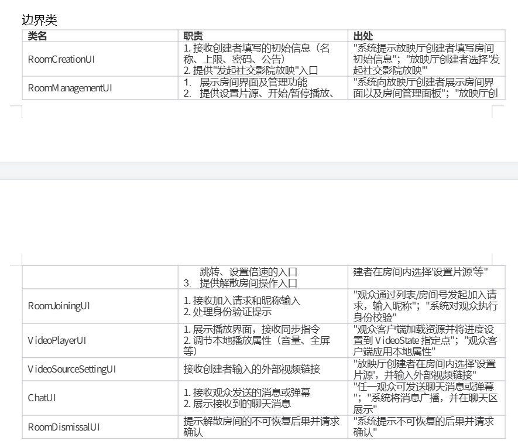
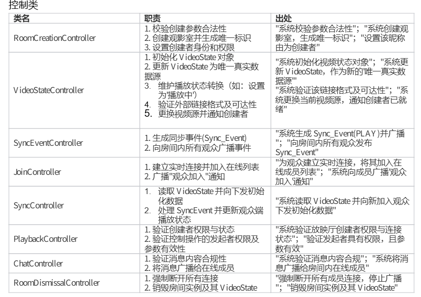
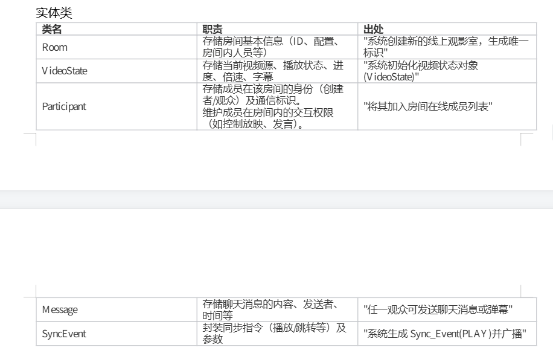
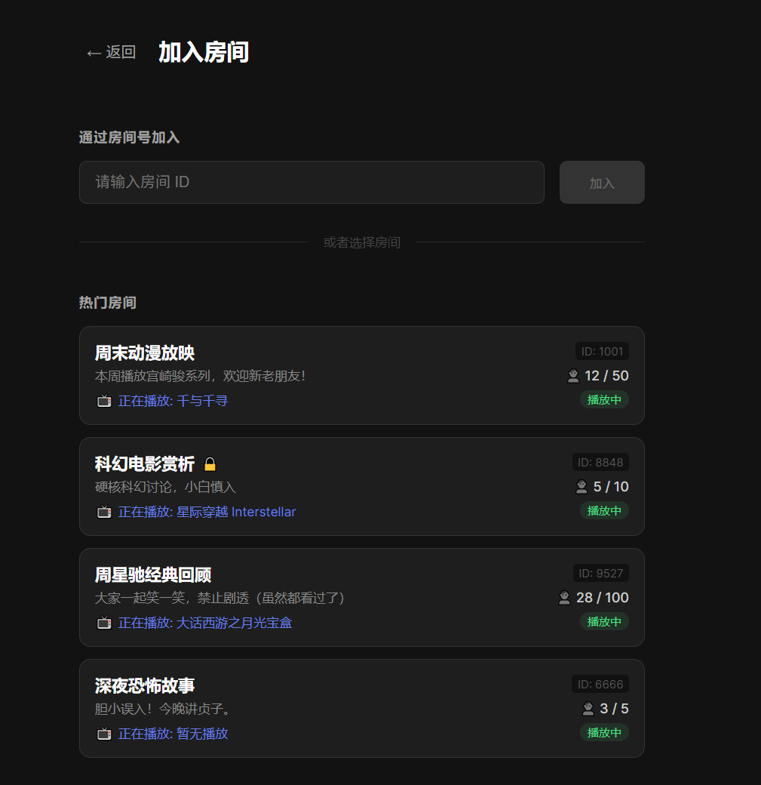
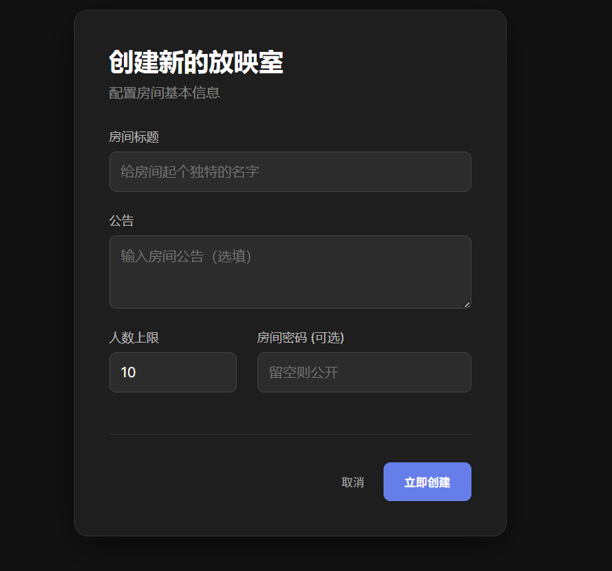

## （一）UC-01 参与社交影院
### 1.简略描述
本用例描述观众们在一个共同的虚拟房间内（线上观影室）进行共同观影：用户创建房间并加载视频资源，观众加入房间后由系统完成播放状态初始化与持续同步；在放映过程中，放映控制者可以控制放映节奏与内容，观众进行实时讨论互动，放映厅创建者维护房间秩序并在活动结束后解散房间。
### 2.用例图
### 3.前置条件
●放映厅创建者已登录系统。
●系统可用（能够创建房间并提供实时同步与互动服务）。

### 4.基本流
{启动活动}
1.用例启动：放映厅创建者选择“发起社交影院放映”。
2.系统提示放映厅创建者填写房间初始信息（例如：房间名称、人数上限、是否启用密码、公告）。
{创建线上观影室（初始化房间）}
3.放映厅创建者提交创建请求及初始配置。
4.系统校验参数合法性（名称格式、人数上限范围等）。
5.系统创建新的线上观影室，生成唯一房间标识（房间号/链接等）。
6.系统初始化视频状态对象（VideoState）：
○当前视频源：空（未加载）
○播放状态：暂停
○进度：0
○倍速：1.0
○字幕：默认/空
○说明：房间的“公告/密码/人数上限/聊天模式”等属于房间配置，由系统保存并在成员加入时可见/可验证，但不属于 VideoState 的播放状态字段。
7.系统要求创建者设置昵称，将该昵称设置为该房间的“放映厅创建者”（最高权限）。
8.系统向放映厅创建者展示房间界面以及房间管理面板。
{设置片源（检索/选择/加载）}
9.放映厅创建者在房间内选择“设置片源”，并输入外部视频链接。
10.系统验证该链接格式及可达性。
11.系统更换当前视频源，通知创建者视频已就绪。
a.系统生成 Sync_Event(CHANGE_SOURCE) 并广播给房间内所有在线成员。
b.观众接收事件，自动加载新视频源并重置播放器状态。（新增）
{观众加入并建立连接}
12.观众通过房间列表/房间号 发现目标房间，并发起加入请求。
13.系统对观众执行身份校验（如：密码校验、房间是否满员、是否被踢出/拉黑）,通过后要求输入昵称。
14.系统为观众建立实时连接，并将其加入房间在线成员列表。
15.系统向房间内成员广播“观众加入”的系统通知。
{观众初始化同步（状态对齐）}
16.系统读取 VideoState 并向新加入观众下发初始化数据（视频源、字幕、基准时间戳、是否播放、倍速等）。
17.观众客户端加载视频资源与字幕，将进度设置到 VideoState 指定的时间点，并设置播放倍速。
18.观众客户端应用本地属性（音量/清晰度/弹幕开关等），且这些变化不影响 VideoState。
19.观众客户端进入同步监听状态，等待并处理后续 `Sync_Event`。
{开始放映}
20.放映厅创建者点击“开始播放”。
21.系统验证放映厅创建者权限与连接状态。
22.系统更新 VideoState 为“播放中”，并写入新的基准时间戳。
23.系统生成 `Sync_Event(PLAY)` 并广播给房间内所有观众。
24.所有观众客户端接收事件并切换为播放状态。
{放映中控制与全员强制同步（循环）}
25.在播放过程中，放映厅创建者可重复执行控制操作：播放/暂停、跳转进度、调整倍速（以及字幕切换等）。
26.对于每一次控制操作，系统执行以下可观察行为：
1. 系统验证发起者具有控制权限，且操作参数有效。
2. 系统更新 VideoState（进度/状态/倍速/字幕等），作为新的“唯一真实数据源”。
3. 系统向房间内所有观众发布对应类型的 `Sync_Event`			（PAUSE/PLAY/SEEK/CHANGE_RATE/CHANGE_SUBTITLE）。
4. 观众端依据事件进行强制对齐：若误差超过同步阈值，必须执行强制校准（例如跳转到目标进度）。
{观众讨论互动（并行持续）}
27.在放映期间，任一观众可发送聊天消息或弹幕。
28.系统验证消息内容合规（长度/格式/频率/权限）。
29.系统将消息广播给房间内在线成员，并在聊天区展示。
{结束活动并解散房间}
30.放映厅创建者选择“解散房间”。
31.系统提示不可恢复的后果并请求确认。
32.放映厅创建者确认。
33.系统强制断开所有成员连接，停止同步广播。
34.系统销毁房间实例及其 VideoState（并按策略清理会话数据）。
35.用例结束。
---
第一次迭代我们选取核心用例“参与社交影院”的基本流，主要实现从创建观影室、设置并播放外部视频链接、观众加入房间、同步观看、聊天、退出和结束放映这一周期涉及到的核心活动。

## 一、健壮性分析
运用 BCE 模式 对社交影院的基本流进行初步解构：通过识别边界类（Boundary）明确人机交互的界面边界，通过控制类（Control）封装复杂的业务规则与流程调度，通过实体类（Entity）承载系统核心的数据状态。

初步健壮性分析，**注意：以下仅为初步分析，实际设计中可能需要更细化的类划分与职责分配**。

### 1.边界类（Boundary Classes）

### 2.控制类（Control Classes）

### 3.实体类（Entity Classes）

## 二、系统架构设计
### 架构目标与约束
#### （一）本系统的架构设计旨在实现以下目标：
1. 可维护性与模块化：通过清晰的模块划分和接口设计，确保系统各部分职责明确，便于独立开发、测试和维护。即使采用单体部署，在逻辑上也要实现"微服务化"的模块分离。
2. 实时性与低延迟：优化实时通信机制，确保视频同步延迟低于1秒，消息传递延迟低于500毫秒，提供流畅的同步观影体验。
3. 可扩展性与演进能力：架构设计需支持未来功能扩展，包括用户规模增长、功能模块增加以及可能的微服务拆分，而无需大规模重构。
4. 开发效率与团队协作：前后端分离架构支持并行开发，明确的接口契约减少团队间依赖，提高开发效率。
5. 技术栈统一与生态整合：充分利用JavaScript生态系统优势，前后端技术栈保持一致，降低学习成本和技术栈切换开销。
#### （二）架构约束
6. 存储约束（第一次迭代）：
a.所有业务数据（房间、参与者、视频状态）存储在进程内存中
b.服务器重启或进程崩溃导致数据完全丢失
c.无持久化存储需求，简化部署复杂度
d.用户会话和权限信息临时存储
7. 部署约束：
a.单体应用部署，所有功能模块打包在一个Node.js进程中
b.单服务器部署，不考虑分布式架构
c.内存存储限制并发用户数和房间数
8. 技术栈约束：
a.前端：Vue.js 3.x + JavaScript(TypeScript)
b.后端：Node.js v25.2.1 + Express.js + Socket.IO
c.视频处理：FFmpeg + Nginx HLS模块
d.操作系统：Linux（manjaro/Archlinux）
9. 兼容性约束：
a.支持现代浏览器（Chrome 90+、Firefox 88+、Safari 14+）
b.响应式设计，支持PC端和移动端浏览器访问

### 软件架构风格说明
#### （一）前后端分离架构（SPA+RESTful/WebSocket）
由于本项目的要实现“一端搭建，多端共享”，未来会涉及到多端（手机、平板、电脑）观影，所以采用前后端分离的架构，充分利用前后端分离的优势。具体实现如下：
1.前端独立应用：
a.使用Vue.js构建单页面应用（SPA）
b.前端独立开发、构建和部署
c.通过RESTful API和WebSocket与后端通信
d.前端负责UI渲染、用户交互和客户端状态管理
2.后端API服务：
a.提供纯API接口，不涉及页面渲染
b.负责业务逻辑处理、实时通信和数据管理
c.采用无状态设计（除内存存储外），便于未来扩展
3.通信协议：
a.HTTP/REST用于常规数据请求（房间管理、配置等）
b.WebSocket（通过https://socket.io/ ）用于实时同步和聊天
c.统一的数据交换格式（JSON）

本项目采用前后端分离架构的优势
●高可维护性： 前端和后端代码库完全解耦，可独立开发、测试和部署 。
●更好的性能：前端资源后续可独立部署在CND上，以减少服务器压力。
●更好的用户体验：SPA提供更流畅的交互体验
●多端支持： 同一套 API 接口可以同时支持 Web、移动端和桌面客户端 。

#### （二）基于DDD思想的分层设计
水平上分为表现层、应用层、领域层、基础设施层（存疑）。
各层职责说明
1.表现层：
a.用户界面渲染和交互处理
b.客户端状态管理
c.API调用和WebSocket通信封装
d.本地数据验证和格式化
2.应用层：
a.请求路由和分发
b.身份验证和权限检查
c.业务逻辑编排
d.事务管理和一致性保证
e.WebSocket连接管理和事件分发
3.领域层：
a.核心业务实体定义（Room, VideoState, Participant等）
b.业务规则和领域逻辑
c.内存数据存储和管理
d.实体间的关系和聚合

MVC模式
通过 MVC 模式，我们将表示层的交互（View/Controller）与领域层的业务逻辑（Model）分离，从而实现界面与业务的独立演化。

前端MVC实现
●Model：Vuex状态管理 + 组件响应式数据
○存储应用状态（房间信息、用户信息、播放状态）
○通过actions/mutations管理状态变更
○与服务层交互获取和更新数据
●View：Vue模板和组件
○渲染用户界面
○接收用户输入事件
○展示数据和状态变化
●Controller：Vue组件方法 + Vuex Actions
○处理用户交互
○调用服务层方法
○更新Model状态
○管理组件生命周期

后端MVC实现
●Model：内存对象模型（Mock模式）
○业务实体类（Room, VideoState等）
○内存存储管理（模拟数据库操作）
○为未来持久化存储提供兼容接口
●Controller：路由控制器 + Socket.io处理器
○接收HTTP请求和WebSocket消息
○参数验证和格式化
○调用服务层处理业务逻辑
○返回响应或广播事件
●Service：业务逻辑服务层
○实现具体的业务规则
○协调多个领域对象协作
○处理事务和一致性
○为Controller提供简洁接口

#### （三）模块化单体架构与垂直分区
由于时间关系，本项目先从单体架构起步，尽快实现第一个版本。但未来有想法将视频转码（需要部署在高性能服务器上）、视频存储与分发（需要部署在网络高速，存储量大的服务器上）、后端（随意一台有公网的服务器即可）等功能提取出来作为微服务，所以即使采用单体架构，在架构上也要实现逻辑模块化，为未来微服务拆分做准备：
 1.模块划分原则
1.高内聚低耦合：相关功能集中，模块间依赖最小化
2.明确接口契约：模块间通过定义良好的接口通信
3.独立可测试：每个模块可独立测试和验证
4.渐进式拆分：支持按需将模块拆分为独立微服务
 2.核心功能模块
第一次迭代针对“参与社交影院”的基本流涉及到的功能，进行划分:
房间管理模块 (Room Management)
●房间创建/解散
●房间配置管理
同步控制模块
●视频状态管理
●同步事件分发
●客户端状态对齐
聊天互动模块
● 消息收发

 3.模块通信机制
●同步调用：模块间方法调用（用于紧耦合操作）
●事件驱动：通过事件总线进行解耦通信
●共享存储：通过统一的内存存储管理器访问数据
●接口隔离：每个模块对外提供明确的服务接口

---

要求： 该软件采用前后端架构，分为了三个子系统模块：房间管理模块 (Room Management)
●房间创建/解散
●房间配置管理
同步控制模块
●视频状态管理
●同步事件分发
●客户端状态对齐
聊天互动模块
● 消息收发

我目前需要开发该软件的房间管理模块的后端，采用express5.2.1和nodejs25.2.1。 请你为我生成代码，目录结构要清晰明了，并且要有详细的注释说明每个文件和每个函数的作用。
代码要符合面向对象编程思想和最佳实践，设计模式由你决定。为我后续编写详细设计文档做好准备。
我的前端已经开发好了，请你帮我编写后端代码，使得前后端可以顺利对接，实现房间的创建和解散功能，以及查看房间列表。
这是前端界面的截图： 

前端需要调用的接口由你来设计，请你帮我设计接口文档，接口文档要详细说明每个接口的请求方式，请求参数，请求头，请求体，响应体等信息,并且要符合RESTful API设计规范，还要给出前端调用教程。